# suilens-microservice-tutorial

Microservices tutorial implementation for Assignment 1 Part 2.2.

## Run

```bash
docker compose up --build -d
```

## Migrate + Seed (from host)

```bash
(cd services/catalog-service && bun install --frozen-lockfile && bunx drizzle-kit push)
(cd services/order-service && bun install --frozen-lockfile && bunx drizzle-kit push)
(cd services/notification-service && bun install --frozen-lockfile && bunx drizzle-kit push)
(cd services/catalog-service && bun run src/db/seed.ts)
```

## Smoke Test

```bash
curl http://localhost:3001/api/lenses | jq
LENS_ID=$(curl -s http://localhost:3001/api/lenses | jq -r '.[0].id')

curl -X POST http://localhost:3002/api/orders \
  -H "Content-Type: application/json" \
  -d '{
    "customerName": "Budi Santoso",
    "customerEmail": "budi@example.com",
    "lensId": "'"$LENS_ID"'",
    "startDate": "2025-03-01",
    "endDate": "2025-03-05"
  }' | jq

docker compose logs notification-service --tail 20
```

## Stop

```bash
docker compose down
```

# Tugas 3 - Suilens API and Kubernetes Deployment

## Data Diri
- Nama: Muhammad Faizi Ismady Supardjo
- NPM: 2306244955

## Docker Hub Image Links
- Catalog Service: https://hub.docker.com/r/faiziismady/suilens-catalog
- Order Service: https://hub.docker.com/r/faiziismady/suilens-order
- Notification Service: https://hub.docker.com/r/faiziismady/suilens-notification
- Frontend: https://hub.docker.com/r/faiziismady/suilens-frontend

## Deskripsi Tugas
Pada tugas ini saya melakukan modifikasi pada project `suilens` hasil clone/fork dari:

- https://github.com/reyhanwiyasa/a03-suilens

Modifikasi yang dilakukan:
- Implementasi dokumentasi OpenAPI untuk setiap endpoint yang ada.
- Implementasi API WebSocket pada `suilens` agar notifikasi order muncul langsung pada frontend.
- Menjalankan smoke test sesuai instruksi README dengan mengganti:
  - `customerName` menjadi nama saya
  - `customerEmail` menjadi `2306244955@gmail.com`
- Melakukan deployment aplikasi ke local Kubernetes cluster dengan namespace `suilens-2306244955`.

## Implementasi OpenAPI
Dokumentasi OpenAPI diimplementasikan pada seluruh service backend berikut:
- `catalog-service`
- `order-service`
- `notification-service`

Swagger UI masing-masing service dapat diakses melalui endpoint:
- `catalog-service`: `http://192.168.1.100:3001/swagger`
- `order-service`: `http://192.168.1.101:3002/swagger`
- `notification-service`: `http://192.168.1.102:3003/swagger`

### Output command ‘kubectl get pods –o wide’.
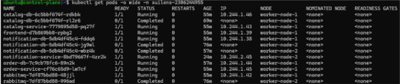

### Screenshot OpenAPI - Catalog Service
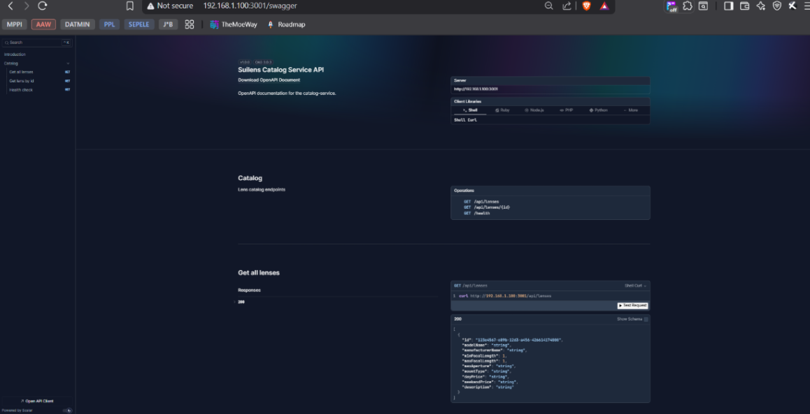
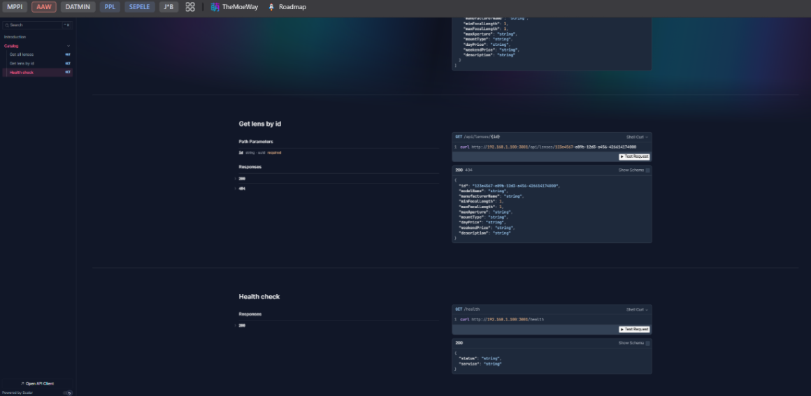

### Screenshot OpenAPI - Order Service
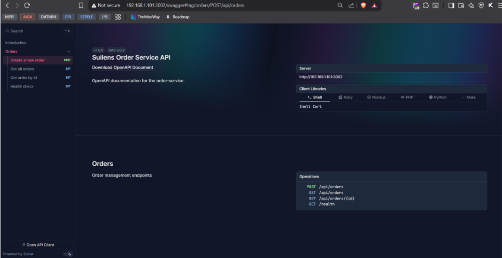
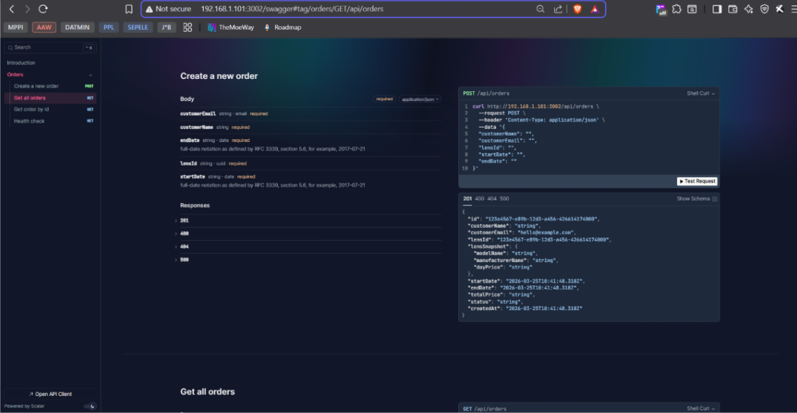
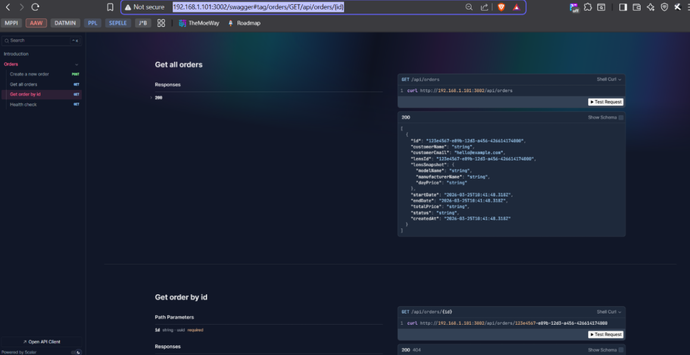
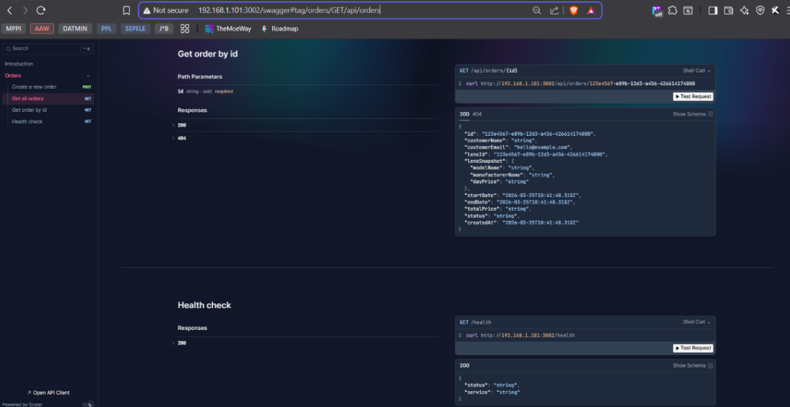

### Screenshot OpenAPI - Notification Service
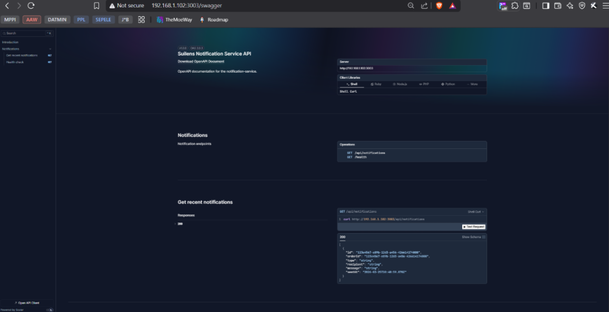
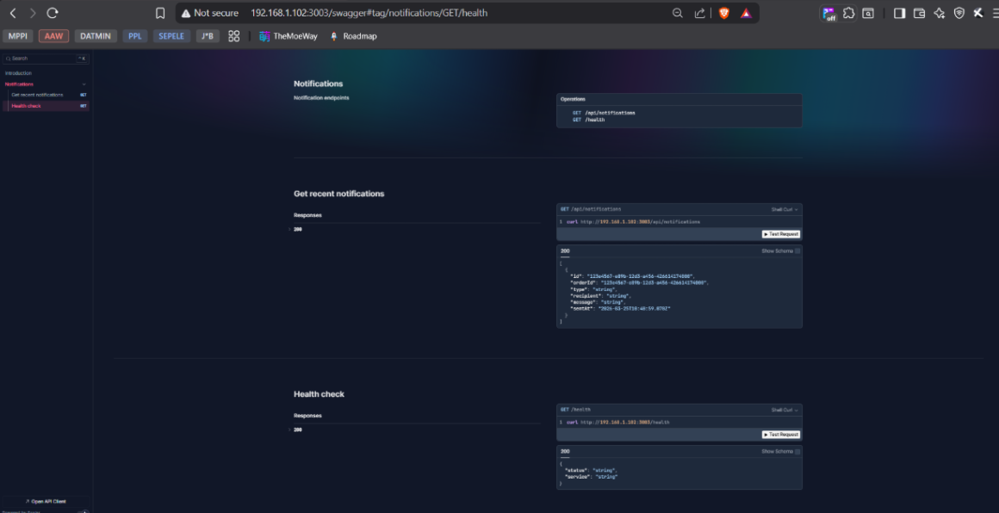

## Implementasi WebSocket
WebSocket diimplementasikan pada `notification-service` untuk menerima event order dan menampilkan notifikasi secara real-time di frontend.

Frontend berhasil terkoneksi ke WebSocket dan menampilkan status `Connected`.

### Screenshot Frontend Sebelum Smoke Test
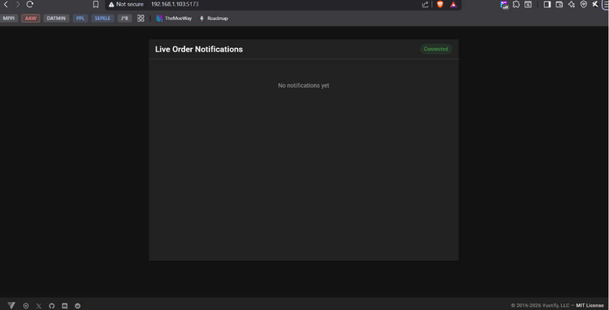

### Body Smoke Test
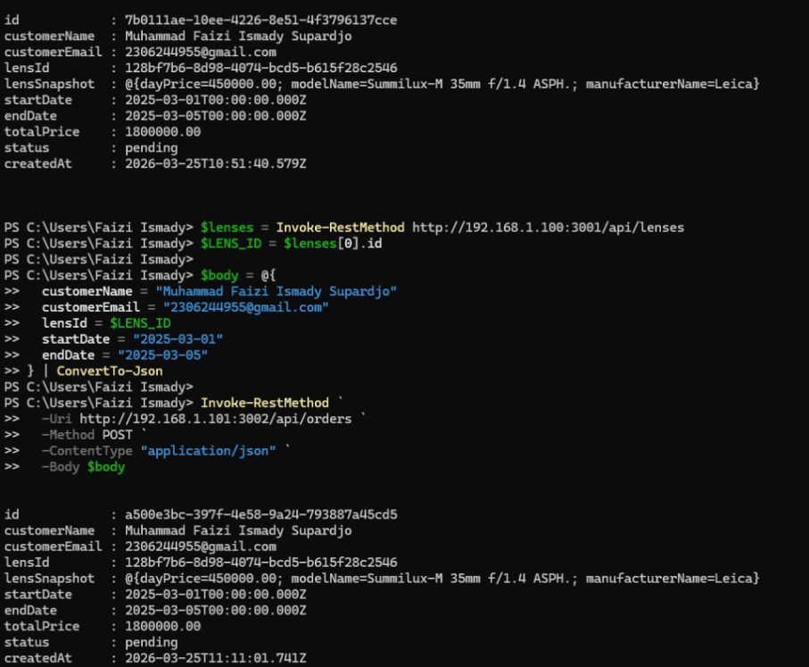

### Screenshot Frontend Setelah Smoke Test
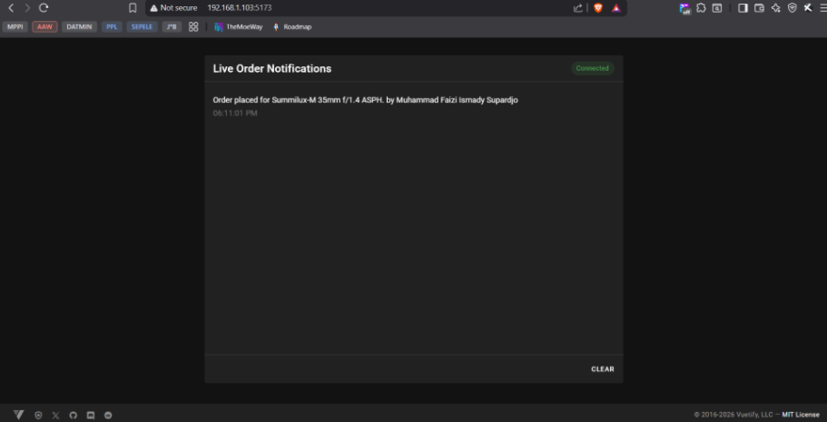

## Smoke Test
Smoke test dijalankan berdasarkan instruksi pada README project `suilens`, dengan data sebagai berikut:
- `customerName`: Muhammad Faizi Ismady Supardjo
- `customerEmail`: 2306244955@gmail.com

### Command Smoke Test
```powershell
$lenses = Invoke-RestMethod http://192.168.1.100:3001/api/lenses
$LENS_ID = $lenses[0].id

$body = @{
  customerName = "Muhammad Faizi Ismady Supardjo"
  customerEmail = "2306244955@gmail.com"
  lensId = $LENS_ID
  startDate = "2025-03-01"
  endDate = "2025-03-05"
} | ConvertTo-Json

Invoke-RestMethod `
  -Uri http://192.168.1.101:3002/api/orders `
  -Method POST `
  -ContentType "application/json" `
  -Body $body
